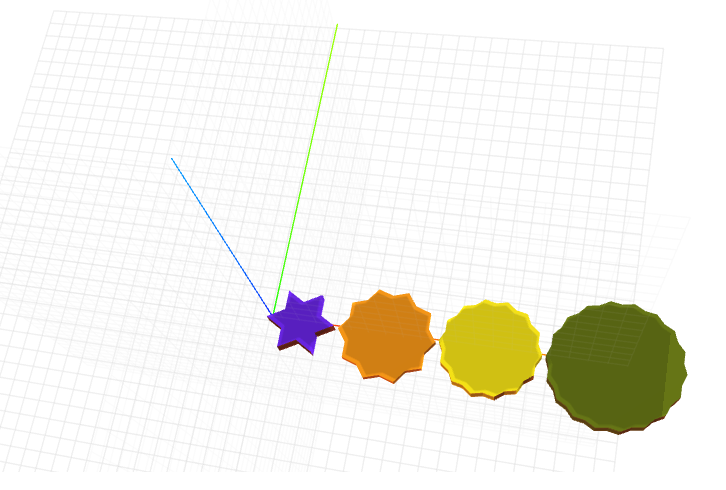

# craft-star
Parameterized star

## Install:

    $ npm install craft-star

## Parameters:

**sides:** To adjust the number of edges of the star

**radius:** To adjust radius of star

**height:** To adjust height of star

